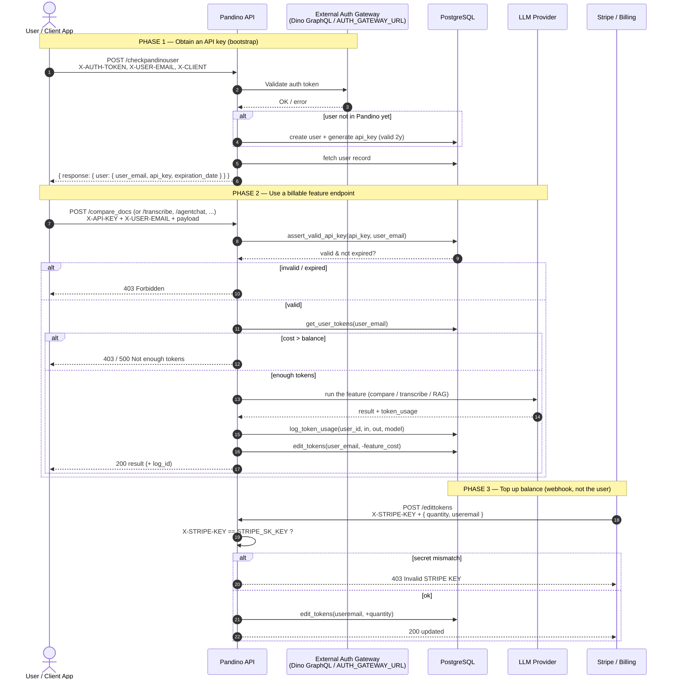
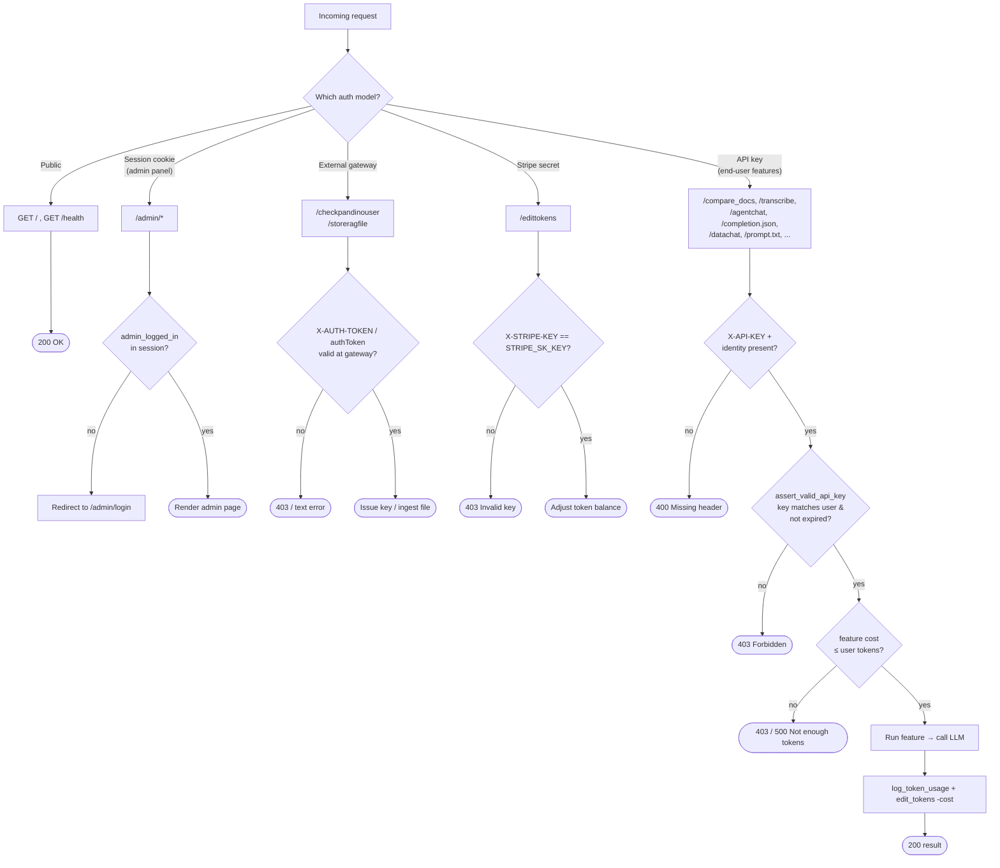

# Pandino — Authentication & Endpoint Usage Flow

Mermaid diagrams describing the full lifecycle: obtaining an API key, using a
billable feature endpoint, and topping up the token balance. These reflect the
actual code paths in `routes/auth.py`, `routes/utils.py`, the feature routes, and
`routes/users.py`.

## 1. End-to-end lifecycle (sequence)

## 2. Per-request auth + token gate (flowchart)

## Notes

- The **identity** paired with `X-API-KEY` varies by endpoint — `X-USER-EMAIL` header
  on most, but a `username` field in the JSON body for `/feedback`, `/completion.json`,
  and `/agentchat` (and `useremail` for `/edittokens`).
- `X-USER-NAME` is **not** part of authentication — it is only used by DataChat to key
  the in-memory agent, and is required-but-unused on `/transcribe`.
- Not every API-key endpoint bills tokens: `/validateapikey` and `/getusertokens`
  authenticate but skip the token gate and deduction.
